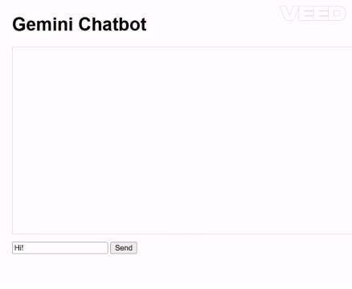

# Gemini Chatbot 🤖✨

This is a simple web-based chatbot built using **Node.js** and the **Gemini 2.5 Pro API** via REST.  
It takes user input from a browser and responds conversationally using Google’s Gemini model.

---

## 🧠 Features
- Built with **Express.js**
- Uses **Gemini Pro (2.5)** via **REST API** and **API Key**
- Clean and interactive frontend
- Easily customizable and extendable

---

## 📸 Demo



---

## 🚀 How to Run the Chatbot Locally

### 1. Clone the Repository

```bash
git clone https://github.com/notsorudy/23b2496_Build_Your_Own_GPT_Bot.git
cd 23b2496_Build_Your_Own_GPT_Bot/Week-4/gemini-chatbot```

---

### 2. Install Dependencies

Make sure you have Node.js installed.
Then run the following to install required packages:

```bash
npm install```

---

### 3. Set up Environment Variables

Create a .env file in the gemini-chatbot folder and add your Gemini API key like this:

```bash
GEMINI_API_KEY=YOUR_ACTUAL_API_KEY```

---

### 4. Run the Server

```bash
npm start```

Then open your browser ans go to: http://localhost:3000

🎉 You're all set! The Gemini chatbot should be running in your browser.

