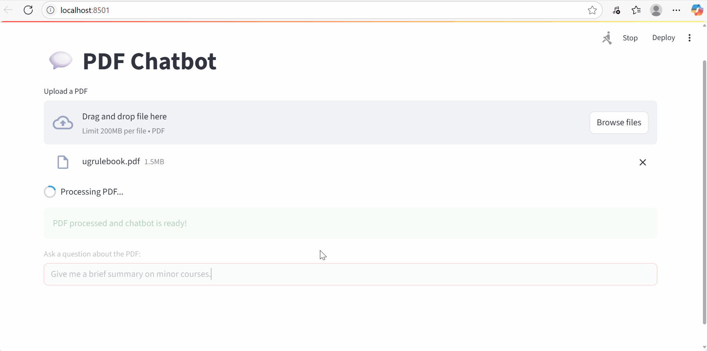

# 🎓 IIT Bombay UG Academic Rules Chatbot

This is a conversational AI chatbot that helps students with queries about IIT Bombay's undergraduate academic rules and circulars.

It uses **Gemini 1.5 Flash + RAG** to fetch relevant sections from the UG rulebook and generate helpful, student-friendly responses.

## 🚀 Features

- Upload UG Rulebook PDFs
- Retrieve relevant context
- Conversational memory
- Deployed with Streamlit

## 🌐 Live Demo

👉 [Link to your deployed Streamlit app](https://your-app-url.streamlit.app)

## 📸 Demo



## 🛠️ Installation

```bash
git clone https://github.com/yourusername/iitb-ug-rules-chatbot.git
cd iitb-ug-rules-chatbot
pip install -r requirements.txt
